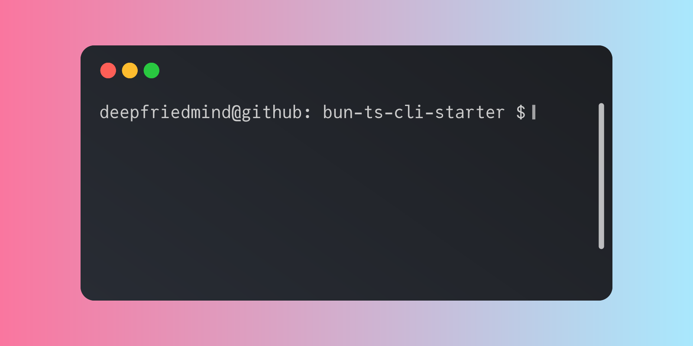

# Bun TS CLI Starter


[](https://biomejs.dev)



My starter kit for developing CLI apps using:

- [Bun](https://bun.com/) (and its built-in [test runner](https://bun.com/docs/cli/test))
- [TypeScript](https://www.typescriptlang.org/)
- [Commander.js](https://github.com/tj/commander.js)
- [Consola](https://github.com/unjs/consola)
- [figlet.js](https://github.com/patorjk/figlet.js)
- [gradient-string](https://github.com/bokub/gradient-string)
- [terminal-link](https://github.com/sindresorhus/terminal-link)
- [Biome](https://biomejs.dev/)
- [Ultracite](https://www.ultracite.ai/)
- [Knip](https://knip.dev/)
- [simple-git-hooks](https://github.com/toplenboren/simple-git-hooks)
- [devmoji](https://github.com/folke/devmoji)
- [Release It!](https://github.com/release-it/release-it)


## Setup

```bash
# Clone the repository
mkdir <new project name>
git clone https://github.com/deepfriedmind/bun-ts-cli-starter.git <new project name>
cd <new project name>

# Install dependencies
bun install

# Run the project entrypoint
bun start

# Build the project
bun run build

# Run tests
bun test

# Run tests with coverage
bun test --coverage

# Run all checks
bun run check
```

## Contributing

Contributions are welcome! Please feel free to submit a Pull Request. For major changes, please open an issue first to discuss what you would like to change.

### Development guidelines

1. **TypeScript**: All code must be written in TypeScript
2. **Testing**: New features must include comprehensive tests
3. **Documentation**: Update README.md for new features
4. **Code Style**: Follow the existing code style and linting rules

## License

This project is licensed under the MIT License - see the [LICENSE](LICENSE) file for details.

---
